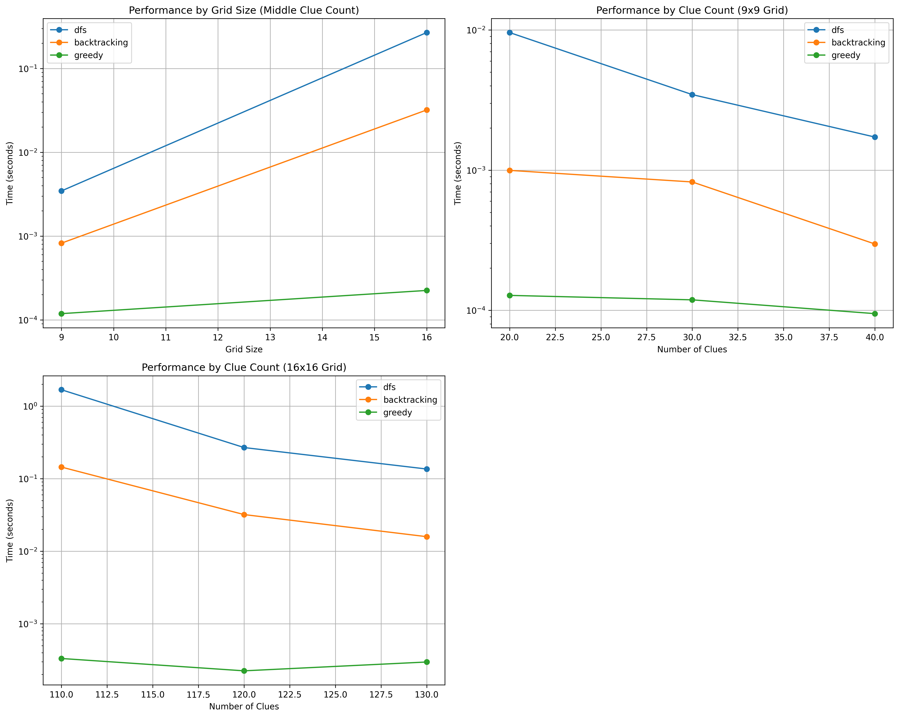

# Звіт: Пошук рішень з використанням алгоритму Backtracking
Над проєктом працювала команда №3: Бугір Єлизавета, Боднар Аліна, Карпіна Олеся, Дзюба Оксана


У цьому проєкті ми досліджуємо потужність алгоритму Backtracking для розв'язання класичних задач на пошук та комбінаторику. Ми реалізували декілька задач і проаналізували їх складність, ефективність порівняно з іншими методами розв'язання.

## Задачі, які ми реалізували:
> Розв'язання судоку - Боднар Аліна

> Вихід з лабіринту - Карпіна Олеся

> Кросворд - Карпіна Олеся

> Задача розфарбування графа - Дзюба Оксана

> N-Queens - Бугір Єлизавета

> Візуалізація вище перелічених задач - Боднар Аліна

## Реалізація на основі backtracking, порівняння ефективності з іншими методами, аналіз складності алгоритмів
### Розв'язання судоку
Алгоритм Backtracking - це метод, який перебирає всі можливі варіанти і повертається назад, якщо вибраний шлях не веде до розв’язку.
#### Кроки:
1. У нашій реалізації він спочатку шукає першу порожню клітинку за допомогою ```find_empty_cell```. Програма шукає першу клітинку, яка ще не заповнена (0). Якщо таких немає - судоку розв’язане, і функція повертає True.
2. Спроба вставити число від 1 до 9 для знайденої порожньої клітинки: ```for num in range(1, size + 1):``` Але ми вставляємо число лише якщо воно не порушує правила судоку.

3. Перевірка правильності вставки за допомогою ```is_valid(board, row, col, num)```
Ця функція перевіряє:
* чи вже є таке число у цьому рядку
* чи є в цьому стовпці
* чи є в маленькому 3×3 квадраті

4. Рекурсивний виклик для наступної клітинки
Після вставки алгоритм знову викликає сам себе для наступної порожньої клітинки:
```if solve_backtracking(board): return True```
5. Якщо шлях неправильний — ми повертаємося назад (робимо "відкат"):
```board[row][col] = 0```

#### Візуалізація
* Консоль:
Використано модуль colorama, щоб підсвічувати клітинку, яку програма щойно заповнила:
```from colorama import init, Fore, Back, Style```
```init(autoreset=True)```
```highlight``` підсвічує зеленим фоном клітинку, яка зараз заповнюється.
Після кожного кроку робиться затримка:
```time.sleep(delay)```

* Візуалізація через Pygame:
Створюється вікно 540x540 пікселів.
Кожна клітинка малюється у прямокутнику.
Коли заповнюється нова клітинка — вона відображається зеленим кольором.
Після кожного ходу робиться пауза ```pygame.time.delay(100)``` для наочності.
Щоб запустити розв’язування або закрити вікно треба натиснути пробіл.


#### Запуск:
Запускається з терміналу командою: ```python3 sudoku.py console```.

Щоб запустити візуальну версію: ```python3 launcher.py```
### Порівняння різних методів
Ми протестували різні імплементації судоку через використання бектрекінгу, dfs та жадібного методу. 
#### Детальніше про методи:
* DFS (глибина у пошук) - перебирає варіанти послідовно
* Backtracking (з поверненням) - розумніше шукає рішення, повертається назад при помилках
* Greedy (жадібний) - ставить число в першу доступну клітинку, без перевірки всіх варіантів

Ми протестували алгоритми на двох розмірах дошок, стандартному 9х9 і більшому розмірі 16х16. Також ми використали різну кількість підсказок (clues), щоб порівняти, наскільки швидко кожний алгоритм справляється з дошкою в залежності від заповненості початкової дошки.
Для дошки 9х9 було дано 20, 30 і 40 підсказок. Для 16х16 - 110, 120 і 130.

Ми вивели 3 графи, щоб порівняти ефективність цих методів:
* перший покаує як змінюється час виконання усіх трьох методів залежно від розміру дошки;
* другий показує їхню роботу залежно від кількості підсказок на дошці 9х9
* третій показує їхню роботу залежно від кількості підсказок на дошці 16х16

#### Аналіз результатів

* Greedy алгоритм — найшвидший у всіх випадках:
Обчислювальна складність:
O(N^2)
Практично завжди працює за 0.0001 - 0.0004 секунд, незалежно від розміру або кількості підказок
Як працює:
Алгоритм заповнює порожні клітинки найпростішим способом: він бере перше можливе число, яке не порушує правила судоку в конкретному місці, і переходить до наступної клітинки. Він не перевіряє, що буде далі, і не повертається назад у разі помилки.
Чому він швидкий:
Він не перевіряє варіанти наперед, а лише перший, що підходить.
Також немає рекурсії або циклічного перебору варіантів.
ВПроте він не гарантує правильне чи унікальне рішення. Може виявитися, що подальші клітинки вже неможливо заповнити без конфліктів, але алгоритм цього не помічає.

* Backtracking — стабільний і досить швидкий:
Обчислювальна складність:
O(9^M)
Як працює:
Пробує вставити одне з можливих чисел у клітинку, і переходить далі. Якщо в процесі заповнення виявляється, що далі немає жодного можливого ходу, алгоритм повертається назад і пробує інше число в попередній клітинці.
Чому швидший за DFS:
Він використовує логіку для відсікання поганих рішень рано, тому не перебирає всі варіанти.
Часто розв’язує задачу дуже швидко, особливо коли підказок достатньо (тобто задача не дуже складна).
Чому повільніше за Greedy:
Використовує рекурсію та перевірки кількох варіантів, для точного та гарантовано правильного розв’язання.

* DFS — найповільніший і менш передбачуваний:
Обчислювальна складність:
O(9^M)
Як працює:
Пробує вставити всі можливі числа у клітинки, переходячи якнайглибше у рішенні, навіть якщо вибраний шлях веде до помилки. Він не "переосмислює" вибори до того, як дійде до кінця дерева рішень.
Чому він повільний:
Повністю перебирає всі варіанти, навіть ті, які можна було би відкинути раніше.
Погано працює з великими сітками або задачами з малою кількістю підказок (тобто високою складністю).
На приклад, у випадку з сіткою 16x16 та 120 підказками, час DFS міг зростати до 2 секунд, тоді як Backtracking розв’язував те саме завдання за менше ніж 0.1 секунди.

Можна зробити висновок, що найкраще підходить backtracking: він майже завжди швидкий, і гарантує правильне рішення, на відміну вд швидшого greedy методу


### Вихід з лабіринту
### Реалізація рішення для задачі пошуку шляху в лабіринті з використанням бектрекінгу з евристичною оптимізацією.
Мета — знайти найкоротший шлях від стартової точки A до кінцевої B у складному середовищі.
#### Основні етапи:

Ми використовуємо рекурсивний пошук з поверненням (бектрекінг). У кожній точці лабіринту намагаємось перейти в напрямку, що веде до B, і позначаємо шлях. Якщо до B дійти не вдається — повертаємось назад, і пробуємо інший варіант.

1) Старт з початкової точки A.

2) Знаходимо координати A і B у лабіринті

3) Пошук сусідів:
Отримуємо допустимі сусідні клітинки, куди можна рухатися (не виходячи за межі, не заходячи в стіни):

4) Сортування сусідів (евристика):
Перевага надається тим напрямкам, які ближчі до точки B (Манхеттенська відстань):
```python
neighbors.sort(key=lambda pos: abs(pos[0] - end[0]) + abs(pos[1] - end[1]))
```
5) Основна функція бектрекінгу:
```python
def solve_maze(maze, row, col, path, best_path_length):
    if (row, col) == end:
        return True  # розв’язок знайдено

    maze[row][col] = "*"  # поточний крок
    for r, c in sorted_neighbors:
        if solve_maze(maze, r, c, path + [(r, c)], best_path_length):
            return True

    maze[row][col] = "."  # відкат
    return False
```
#### Візуалізація:

Консоль:

* Вивід лабіринту з кольорами:

        A — зелений

        B — червоний

        '*' — синій (поточний шлях)

        . — сірий (відкат)

* Затримка між кроками реалізована через time.sleep()
* Очистка екрана через clear_screen()

Pygame (графічна візуалізація):

* Вікно 600x600 пікселів

* Кожна клітинка відображається як прямокутник

* Колір залежить від вмісту клітинки:

        "A" — зелений

        "B" — червоний

        "*" — синій

        "." — сірий

        "#" — чорний (стіни)
#### Як запустити та вхід/вихід програми:
Режим задаємо через командний рядок:
```python3 maze.py console``` - консоль візуалізація

```python3 maze.py visual``` - pygame візуалізація

Лабіринт (maze) — жорстко заданий у коді
У режимі console – очікує натискання клавіші Enter для початку роботи.

Вихід:

* У режимі console:

        Виводиться лабіринт у кольорах.

        Відображається процес руху: символи '*' — крок уперед, '.' — шлях, який не привів до цілі.

        Наприкінці — повідомлення:
            Path found! Length: 20
            або
            No path found!
* У режимі visual (pygame):

        Відображається лабіринт у графічному вікні.

        Зеленим — старт A, червоним — ціль B, синім — шлях *, сірим — помилкові кроки ..

        Консоль повідомляє результат:
            Path found! Length: 20
            або
            No path found!
#### Порівняння з DFS, GREEDY:
Алгоритми оцінювались за двома критеріями:
Кількість кроків та час виконання


Алгоритм Greedy є найшвидшим серед усіх трьох. У кращих випадках його складність становить O(n). Завдяки своїй простоті, Greedy швидко знаходить шлях, проте це не завжди оптимальне рішення, і іноді алгоритм взагалі не знаходить вихід у заплутаних структурах.

Складність DFS складає O(V + E), де V — кількість вершин у графі, а E — кількість ребер (у випадку гріду це приблизно O(n²)). DFS гарантує знаходження рішення, якщо шлях існує, проте знайдений маршрут не завжди буде найкоротшим. У тестах DFS показав більшу кількість кроків і більший час виконання порівняно з Greedy, оскільки переглядає більше варіантів.

На практиці Backtracking працює значно швидше завдяки ранньому відсіканню невдалих гілок. У тестах Backtracking показав менше кроків, ніж DFS, і час виконання на тому ж рівні, що свідчить про його більш обережний і систематичний підхід до пошуку шляху. Backtracking демонструє хороший баланс між повнотою пошуку та ефективністю, що робить його надійним вибором для завдань, де важливо гарантовано знайти рішення навіть у складних лабіринтах.
### Кросворд
#### Мета: автоматично заповнити кросворд заданими словами.
#### Основні етапи:
1) Завантаження слів:

Слова беруться з файлу words_2.txt випадковим чином.

2) Початок рекурсії (```python метод solve класу BacktrackingSolver```):

Пробуємо розмістити перше слово у всіх можливих комірках по горизонталі та вертикалі.

Якщо слово підходить (```перевірка в is_valid_placement```):

Розміщуємо його на полі (```place_word```).

Малюємо поточний стан (візуально або в консолі).

Переходимо до наступного слова (```solve(index + 1)```).

Перевірка перетинів слів (```check_intersections```):

Програма перевіряє, чи утворені нові слова при перетині входять у список допустимих.

Бектрекінг:

Якщо розмістити всі слова не вдається — останнє слово видаляється (```remove_word```) і пробується інша позиція.

Цей процес повторюється до тих пір, поки не знайдеться рішення або всі варіанти не буде вичерпано.

#### Візуалізація:

Консоль:

* '.' — порожня клітинка.

* '#' — заблокована клітинка.

* '[A]' — підсвічені перетини.

* A — звичайні літери.

Pygame (графіяна візуалізація):

* Білий — порожня клітинка для заповнення ('-').

* Сірий — заповнена літера.

* Жовтий — підсвічена комірка (напр. при новій спробі розміщення слова).

* Чорний — рамки клітинок.

* Перетини слів виділяються спеціально (у консолі — в квадратних дужках [A]).

#### Як запустити та вхід/вихід програми:
* Вхід:
        Грід кросворду — список списків символів:

        '-' — порожня клітинка для слова.

        '#' — заблокована клітинка (сюди слова не ставляться).

        Грід задається прямо у коді (змінна grid).

        Слова — беруться з файлу words_2.txt (випадково вибирається,наприклад, 5 штук).

* Вихід:
        Заповнений кросворд зі словами.

        У візуальному режимі — показ процесу заповнення.

        У консольному режимі — текстовий вивід поля після кожного кроку.

        Повідомлення про успіх або неможливість знайти рішення.


Режим задаємо через командний рядок:
```python3 crossword.py console``` - консоль візуалізація

```python3 crossword.py visual``` - pygame візуалізація
#### Порівнюємо  із greedy algorythm та brute force:
Шкала часу на графіку - логарифмічна 
Порівняння роботи алгоритмів було виконано на 3 різних "дошках": 4x7, 13x7, 29x7


Жадібний алгоритм (Greedy) є найшвидшим для всіх розмірів сіток, проте важливо зазначити, що він не завжди знаходить рішення. Наприклад, на тестових сітках алгоритм впорався лише з найменшою з них, а на інших — завершувався помилкою, не змігши заповнити сітку повністю. Це відбувається тому, що жадібний підхід завжди обирає локально оптимальний варіант, не враховуючи глобальної картини.

Повний перебір (Brute Force) та бектрекінг (Backtracking) демонструють приблизно однакову швидкість, оскільки обидва мають експоненційну складність O(p^w), де p — кількість можливих позицій для одного слова, а w — кількість слів у завданні. Однак бектрекінг, завдяки ранньому відсіченню невдалих варіантів, часто працює трохи ефективніше на практиці.

### Задача розфарбування графа

### N-Queens

# N-Queens Problem Analysis Report

## Розв'язання задачі N-Queens
N-Queens — це класична комбінаторна задача, де потрібно розмістити N ферзів на шаховій дошці розміром N×N так, щоб жоден ферзь не атакував іншого. Ферзь може атакувати по горизонталі, вертикалі та діагоналях.

### Алгоритм Backtracking - метод, що перебирає всі можливі варіанти і повертається назад, якщо вибраний шлях не веде до розв'язку.

#### Кроки:
1. **Пошук порожньої клітинки**: Алгоритм спочатку шукає порожню позицію на дошці (рядок, де ще немає ферзя).
2. **Спроба розмістити ферзя**: Для знайденого рядка перебираються всі можливі колонки, щоб спробувати розмістити ферзя.
3. **Перевірка коректності розміщення**: Коли позиція знайдена, перевіряється, чи не атакує ферзь інших ферзів (метод `_is_safe`).
4. **Рекурсивний виклик для наступного рядка**: Якщо позиція безпечна, рекурсивно розв'язується та сама задача для наступного рядка.
5. **Повернення назад (відкат)**: Якщо жодне положення в рядку не підходить або подальші кроки не приводять до розв'язку, алгоритм повертається до попереднього рядка і пробує інші варіанти: `board[row] = -1`.

### Візуалізація

#### Консольна версія:
- Відображає рішення у вигляді сітки із символами "Q" для ферзів і "." для порожніх клітинок.
- Виводить статистику виконання алгоритму: кількість кроків, відкатів та час виконання.

#### Графічна версія (Tkinter):
- Створює вікно з шаховою дошкою розміром N×N.
- Дозволяє налаштувати розмір дошки та швидкість анімації.
- Візуалізує процес розміщення ферзів, підсвічуючи клітинки.
- Дозволяє переглядати різні розв'язки за допомогою кнопок навігації.
- Показує повну статистику виконання.

## Порівняння різних методів

Ми протестували різні алгоритми розв'язання задачі N-Queens:

### Детальніше про методи:
1. **Backtracking** - розумно перебирає варіанти з поверненням при помилках:
   - Обчислювальна складність: O(N!)
   - Працює шляхом послідовного розміщення ферзів і відкату при конфліктах
   - Повертається назад і пробує інші варіанти, коли знаходить неправильний шлях

2. **BFS (пошук у ширину)** - будує дерево всіх можливих розміщень:
   - Обчислювальна складність: O(N!)
   - Використовує чергу для зберігання часткових розміщень
   - Розширює всі можливі стани на кожному рівні, перш ніж перейти до наступного

3. **Greedy (жадібний метод)** - обирає перші підходящі варіанти:
   - Обчислювальна складність: O(N²)
   - Намагається розміщувати ферзів випадковим чином серед допустимих позицій
   - Не гарантує знаходження розв'язку, але працює дуже швидко

### Аналіз результатів

На основі графіків, що показують час виконання та кількість кроків алгоритмів в залежності від розміру дошки, можна зробити такі висновки:

#### Greedy алгоритм — найшвидший у всіх випадках:
- Час виконання: 10⁻⁵-10⁻³ секунд (у 10-100 разів швидше за інші методи)
- Кількість кроків: від 5 до 300 (експоненційно менше порівняно з іншими)
- Відсутність гарантії знаходження розв'язку; хоча для N-Queens він часто знаходить хоча б один розв'язок
- Нестабільна продуктивність (видно на графіку "кроків", де лінія має нерегулярний характер)

#### Backtracking — стабільний і досить ефективний:
- Час виконання: зростає експоненційно від 10⁻⁴ до 10⁻¹ секунд для N від 4 до 10
- Кількість кроків: зростає від ~70 до ~10⁶ при збільшенні N
- Гарантує знаходження всіх можливих розв'язків
- Передбачуване зростання складності (прямі лінії на логарифмічній шкалі)

#### BFS — масштабується гірше при зростанні N:
- Час виконання: близький до backtracking для малих N, але швидше стає непрактичним для N > 10
- Кількість кроків: від ~20 до ~10⁵ для N від 4 до 10
- Використовує більше пам'яті через необхідність зберігати всі часткові стани у черзі
- Менш ефективний, ніж backtracking для цієї задачі через характер простору пошуку

## Практичні висновки

1. **Для малих розмірів дошки (N ≤ 8)**:
   - Всі алгоритми працюють достатньо швидко
   - Greedy може бути найкращим вибором, якщо потрібен лише один розв'язок
   - Backtracking найкраще підходить, якщо потрібні всі розв'язки

2. **Для середніх розмірів (8 < N ≤ 15)**:
   - Greedy залишається дуже швидким, але може не знайти розв'язок з першої спроби
   - Backtracking ще практичний, але час виконання значно зростає
   - BFS стає непрактичним через обмеження пам'яті

3. **Для великих розмірів (N > 15)**:
   - Тільки Greedy може дати швидкий результат, але без гарантій
   - Можливо потрібно застосовувати інші спеціалізовані методи

## Оптимізації та можливі покращення

1. **Для Backtracking**:
   - Оптимізація порядку вибору клітинок (наприклад, спочатку заповнювати клітинки з найменшою кількістю доступних варіантів)
   - Використання бітових масок для перевірки допустимості розміщення

2. **Для BFS**:
   - Використання евристики для пріоритезації найбільш перспективних часткових розв'язків
   - Застосування пруніння станів для зменшення простору пошуку

3. **Для Greedy**:
   - Впровадження локального пошуку або випадкових рестартів для підвищення ймовірності знаходження розв'язку
   - Комбінування з іншими методами для отримання гарантованого розв'язку

## Висновок

Задача N-Queens є чудовим прикладом комбінаторної оптимізації, де можна порівняти різні підходи до пошуку розв'язків. Кожен метод має свої переваги та недоліки:

- Backtracking є найбільш універсальним і надійним, гарантуючи знаходження всіх розв'язків, але повільнішим для великих N.
- BFS схожий на backtracking за часом виконання, але використовує більше пам'яті та гірше масштабується.
- Greedy є найшвидшим, але стохастичним і не гарантує знаходження розв'язку.

Вибір алгоритму залежить від конкретних вимог: якщо потрібні всі розв'язки або гарантія знаходження хоча б одного — варто використовувати backtracking; якщо швидкість критична і достатньо одного розв'язку — greedy може бути кращим вибором.

## Висновки: придатність алгоритму backtracking для різних класів задач.

